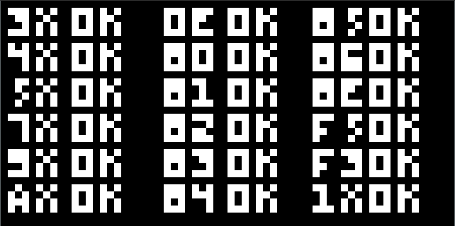

# Chip8

Hardware emulation of chip8 


## Table of Contents

1. [Getting started](#Getting-started)
2. [Usage](#Usage)
3. [Controls](#controls)
3. [Licenses](#license)
4. [Sources](#sources)

## <a id="Getting-started">Getting started</a>
**Clone** the project files to your local repository:

- HTTPS : `https://github.com/edd-ie/Chip8_Emulator.git`
- SSH : `git@github.com:edd-ie/Chip8_Emulator.git`
- Git CLI : `gh repo clone edd-ie/Chip8_Emulator`

**Option 2** - download and extract the zip file


To run the program, open the terminal in the project folder.

```bash
./cmake-build-debug/Chip8_Emulator.exe 15 1 ./roms/1Tester.ch8
```

If this display then the program is working perfectly:



## <a id="Usage">Usage</a>

To run the application you will require 3 values
```bash
./cmake-build-debug/Chip8_Emulator.exe <cmd1> <cmd2> <cmd3>
```
- **cmd1** - integer screen scaling, varies with monitors. 
  - Tested with 10 - 40.
- **cmd2** - game run time, varies with program, your choice. 
  - Tested with 0.0 - 5.0
- **cmd** - ROM location, you can add yours. Some ROMs have been sourced in roms folder. 
  - Pick one and format it in this format ```./roms/<rom_file>.ch8```

## <a id="controls">Controls</a>

To Quit the running application press ```esc```

The chip 8 keypad was remapped for the keyboard
```angular2html
Keypad       Keyboard
+-+-+-+-+    +-+-+-+-+
|1|2|3|C|    |1|2|3|4|
+-+-+-+-+    +-+-+-+-+
|4|5|6|D|    |Q|W|E|R|
+-+-+-+-+ => +-+-+-+-+
|7|8|9|E|    |A|S|D|F|
+-+-+-+-+    +-+-+-+-+
|A|0|B|F|    |Z|X|C|V|
+-+-+-+-+    +-+-+-+-+
```


## <a id="license">Licenses</a>

The project is licensed under the [GNU Affero General Public License v3.0](https://github.com/edd-ie/Chip8_Emulator/blob/main/LICENSE)


## <a id="sources">Sources</a>

Research website - [Cowgod's Chip-8 Technical Reference v1.0](http://devernay.free.fr/hacks/chip8/C8TECH10.HTM)

Portions of the website were inspired by - [Laurens Muller (CHIP-8 interpreter)](https://multigesture.net/articles/how-to-write-an-emulator-chip-8-interpreter/)
